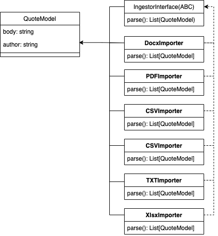
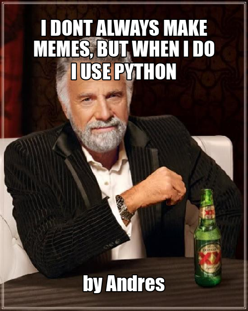
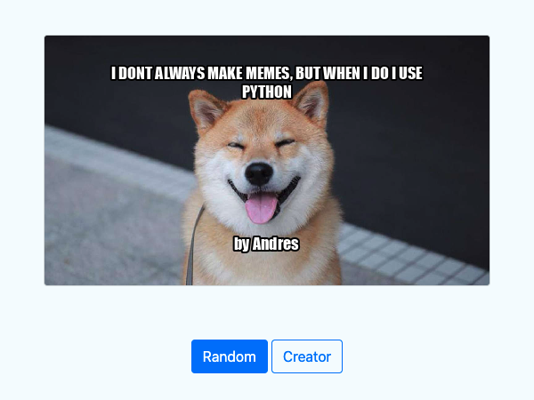

Project: Meme Generator
========================

"Meme Generator" – a multimedia application that dynamically generates memes that's an images with a quote.
This project demonstrates the ability to build large-scale codebases using Python. All the systems are broken out into specific modules allowing for the creation of modular and reusable code.

---------------------------------------------------------------------------------------------------------------------
## 2. Implementation details:

### 2.1 Quote Engine

The Quote Engine module is responsible for ingesting many types of files that contain quotes. For our purposes, a quote contains a body and an author:

```text
"This is a quote body" - Author
```

This module will be composed of many classes and will demonstrate your understanding of complex inheritance, abstract classes, classmethods, strategy objects and other fundamental programming principles.

#### 2.1.1 Quote Format

Example quotes are provided in a variety of files. Take a moment to review the file formats in ./_data/SimpleLines and ./_data/DogQuotes. QuoteEngine module is designed as a system to extract each quote line-by-line from these files.

The abstrat class `IngestorInterface` implements the can_ingest class method which decides if a file is compatible with the importer.

A parse abstract class method signature, fully complete in the children classes that implement the ImporterInterface.

The `Ingestor` class encapsulates the `CSVImporter`, `XlsImporter`, `XlsxImporter`, `DocxImporter`, `TxtImporter`, and the `PDFImporter` classes.

In Figure 1 is presented the class diagrams that describes the implementation of the strategy objects. 



The `DocxImporter` class is responsible for loading data from Docx (Microsoft Word Document) files. The `CSVImporter` class is responsible for loading data from CSV (Comma Separated Value) files, and the same idea applies for the file types xls, xlsx, txt, pdf.

### 2.2 Meme Engine

The `MemeEngine` module is responsible for generating memes.

This module is composed by `MemeGenerator` class that creates a meme using a given image adding a quote and a quote author to the image. 

---------------------------------------------------------------------------------------------------------------------
## 3. Installation of the project: 

1. Install the python-docx library to work with word documents in Python. This library requires a new version of a Python helper module called setuptools. To install the updated helper and the docx library, run:
```sh
pip install -U setuptools
pip install --upgrade pip
```
2. Before explore the code prepare a virtual environment using Python3.6+. Then proceed to install all the dependencies specified in the file requirements.txt
```sh
pip install -r requirements.txt
```
3. pdftotext: Converts pdf to text (.pdf to .txt):
    - installation:
        - sudo apt install poppler-utils (Linux)
        - brew install poppler           (MacOS)
    - converts .pdf to .txt:
    ```sh
    $ pdftotext cats.pdf cats.txt
    ```
4. Add the .env file to the ./libs directory.
```sh
$ cp -f libs/.env.example libs/.env
```
5. Run the project:
```sh
$ python3 meme.py
```
> **Note:** If the project is not running, double check the .env file.
---------------------------------------------------------------------------------------------------------------------
## 4. Testing:
### 4.1 run the Flask server for testing:

The project contains Flask app startup code in app.py.

To start the Flask server, run on your machine:

```py
export PYTHONPATH="${PYTHONPATH}:/<full_path>/Meme_Generator"
export FLASK_APP=app.py
export FLASK_ENV=development
export FLASK_DEBUG=1
flask run --host 127.0.0.1 --port 5000 --reload --debugger
```

> **Note:** the host and port are required to access the server locally. You must add to the `PYTHONPATH` the path of your local repo where the tests will be run.

### 4.2 Unit Tests:

The project has unit tests to validate that the functions and methods works as required:

```py
$ python3 -m unittest --verbose
```
---------------------------------------------------------------------------------------------------------------------
## 5. Run the project:

To run the project you have two options: 

* cli application
* flask server
### 5.1 cli application:

The project contains a simple cli app starter code in `meme.py`. The utility can be run from the terminal by invoking `python3 meme.py`

The `meme.py` script takes three optional CLI arguments:

* `--body` a string quote body
* `--author` a string quote author
* `--path` an image path

Example, execute the following command in your terminal:

```py
python3 meme.py --author Andres --body "I DONT ALWAYS MAKE MEMES, BUT WHEN I DO I USE PYTHON" --path ./_data/photos/old_school/idontalways.jpeg
```

You'll see the following output:



### 5.2 Flask App:

The project contains a flask app starter code in app.py. The app uses the Quote Engine Module and Meme Generator Modules to generate a random captioned meme image.

It uses the requests package to fetch an image from a user submitted URL. The flask server must run with no errors

Example, fill the following form and submit it:


You'll see the following output, after click in the `Create Meme!` button:




---------------------------------------------------------------------------------------------------------------------
Cheers,<br>
Andrés